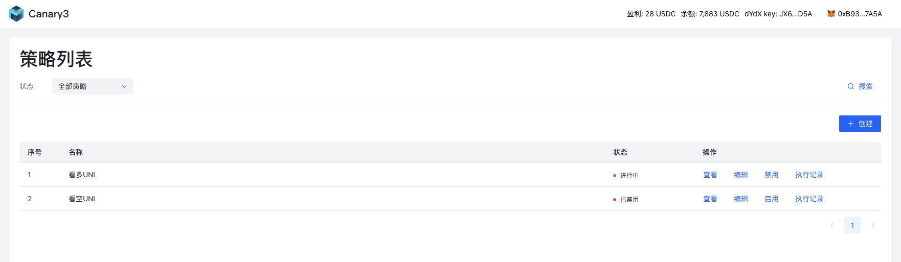
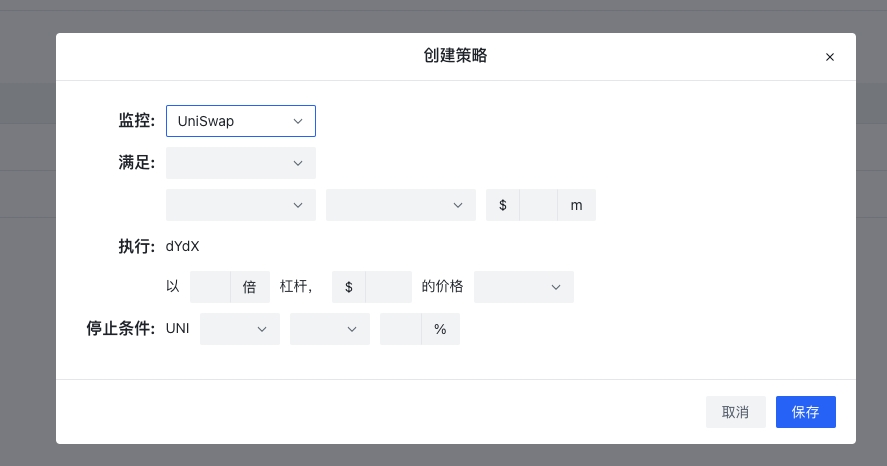
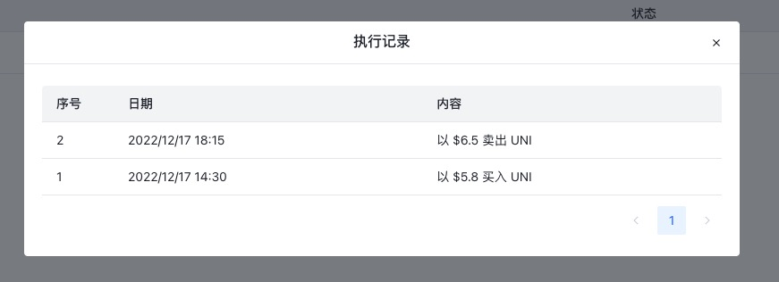

# Canary3 前端
> Canary3 是一款面向 DeFi 应用，支持用户自定义策略的量化交易平台，通过对 DeFi 数据的实时监控和流式计算，当满足预设交易策略规则时可以自动进行资产的买入和卖出。

功能演示 Demo：[这里](https://www.capcut.cn/share/7177950888768705830?t=1)。

策略列表:  


创建策略:  


策略执行记录:  


## 快速开始

```
// 初始化项目
npm install

// 开发模式
npm run dev

// 构建
npm run build
```